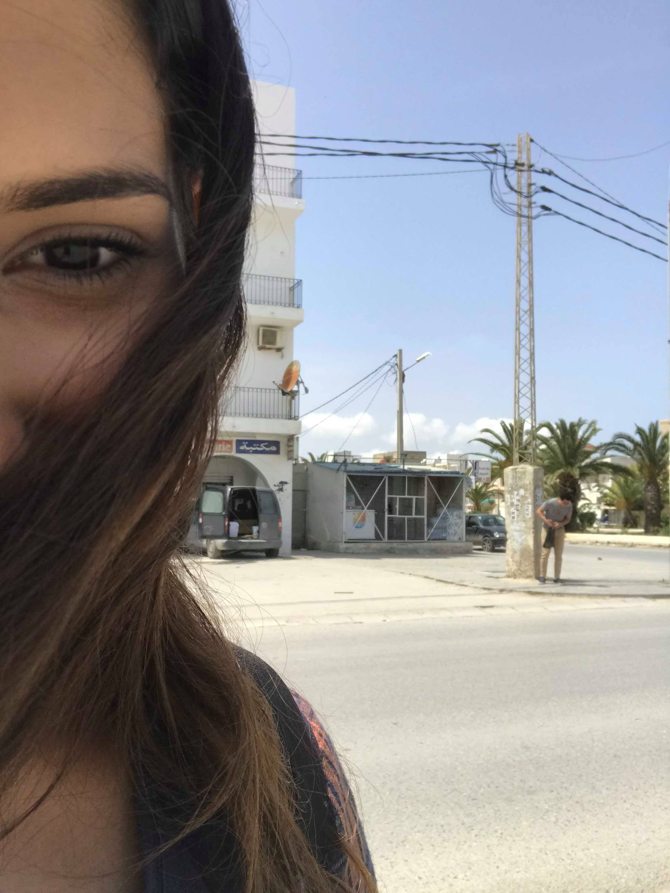

```{r setup, include=FALSE}
knitr::opts_chunk$set(echo = TRUE)


```
when you'will open this app  the date and time  will  be 
``` {r  , comment = "" , echo = FALSE }
library(shiny)
date=date()
h2(date)
```
2 years day by day  have passed since  our first connection ,I 've designed the web site as part of my coursera course ( HAHAHA) but also to share with you some of our best moments together . 





# I want to take a tour through  our first moments


``` {r  , comment = "" , echo = FALSE }
library(leaflet)
# Make a list of icons. We'll index into it based on name.
myIcons <- iconList(
  love = makeIcon(iconUrl ="http://icons.iconarchive.com/icons/kevin-thompson/love-and-breakup/32/love-icon.png",
                    iconWidth = 31*215/230, iconHeight = 31,
                   iconAnchorX = 31*215/230/2, iconAnchorY = 16
)
                  ,
  
  first_d=makeIcon(iconUrl ="http://icons.iconarchive.com/icons/icons8/windows-8/32/Time-Date-icon.png",
                    iconWidth = 31*215/230, iconHeight = 31,
                    iconAnchorX = 31*215/230/2, iconAnchorY = 16
                   ),
  lunch = makeIcon(iconUrl ="http://icons.iconarchive.com/icons/graphicloads/100-flat/32/dinner-icon.png",
                    iconWidth = 31*215/230, iconHeight = 31,
                    iconAnchorX = 31*215/230/2, iconAnchorY = 16
                   ),
  kiss = makeIcon(iconUrl ="http://icons.iconarchive.com/icons/google/noto-emoji-people-family-love/32/12135-kiss-mark-icon.png",
                    iconWidth = 31*215/230, iconHeight = 31,
                    iconAnchorX = 31*215/230/2, iconAnchorY = 16
                   )
  
)

df <- sp::SpatialPointsDataFrame(
  cbind(
    c(10.196527,10.196441 , 10.197515 , 10.196083),
    c(36.842722,36.843330 ,36.844511 , 36.841586)  # lng
      # lat
  ),
  data.frame(type = factor(
    c("first_d","love","lunch","kiss" )
  )),
  
   
  
)


df %>% 
  leaflet() %>%
  addTiles() %>%
  addMarkers(icon = ~myIcons[type] ,popup = c(
    'first date 9odem hall',
    'first connection ',
    'first lunch',
    'first kiss'
    ) )


```


```{r echo=FALSE}
curve(  x^4, from=0, to=2, n=300, xlab="my love ", ylab="time", 
             col="blue", lwd=2, main="love evolution"  )

```


# love you so much 
## happy 2 years anniversary


